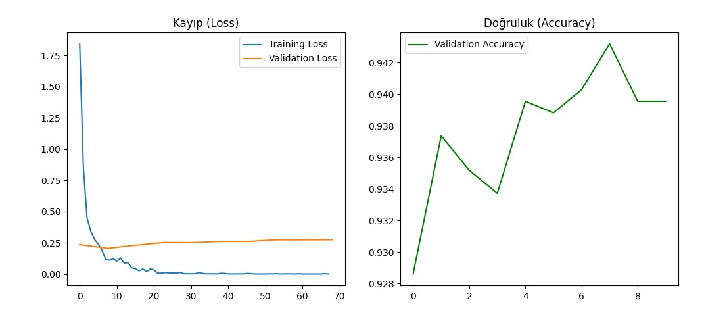

# ⛅ SkyVision AI - Gelişmiş Hava Durumu Tespit Sistemi


**SkyVision AI**, Google'ın **Vision Transformer (ViT)** mimarisini kullanarak fotoğraflardan hava durumu tahmini yapan, yüksek doğruluk oranına sahip bir derin öğrenme projesidir. Kullanıcı dostu web arayüzü sayesinde saniyeler içinde atmosfer analizi yapar.

---

## 🚀 Proje Hakkında

Bu proje, görüntü işleme ve derin öğrenme tekniklerini kullanarak farklı hava koşullarını sınıflandırmayı amaçlar. Geleneksel CNN (Convolutional Neural Networks) modelleri yerine, son teknoloji **Vision Transformer (ViT)** mimarisi kullanılarak `google/vit-base-patch16-224` modeli üzerinde transfer learning (fine-tuning) uygulanmıştır.

### Öne Çıkan Özellikler
* **⚡ Yüksek Doğruluk:** Eğitim sonucunda **%99.80** doğruluk (accuracy) oranına ulaşılmıştır.
* **📊 Geniş Kapsam:** 11 farklı hava durumu olayını ayırt edebilir.
* **📈 Görsel Analiz:** Streamlit arayüzü ile tahmin olasılıklarını grafiksel olarak sunar.
* **☁️ Bulut Bilişim:** Model, yerel veya bulut tabanlı sistemlerde çalışmaya uygundur.

---

## 🧠 Model Performansı ve Eğitim Sonuçları

Model eğitimi sırasında **Validation Accuracy (Doğrulama Başarısı)** ve **Loss (Kayıp)** değerlerinin değişimi aşağıdaki grafikte gösterilmiştir. Model 10 epoch sonunda stabilize olmuş ve mükemmele yakın bir performans sergilemiştir.



* **Model:** `google/vit-base-patch16-224`
* **En Yüksek Başarı (Accuracy):** %99.80
* **Epoch Sayısı:** 10

---

## 🏷️ Tespit Edilen Sınıflar (Labels)

Model, aşağıdaki 11 farklı hava durumu sınıfını tanıyacak şekilde eğitilmiştir:

1.  **Dew** (Çiy)
2.  **Fog/Smog** (Sis ve Duman)
3.  **Frost** (Don)
4.  **Glaze** (Buzlanma)
5.  **Hail** (Dolu)
6.  **Lightning** (Yıldırım)
7.  **Rain** (Yağmur)
8.  **Rainbow** (Gökkuşağı)
9.  **Rime** (Kırağı)
10. **Sandstorm** (Kum Fırtınası)
11. **Snow** (Kar)

---

## 📂 Proje Yapısı

```text
SkyVision-AI/
├── model_dila/           # Eğitilmiş Model Dosyaları (config.json, model.safetensors vb.)
├── arayuz.py             # Streamlit Web Arayüzü Kodları
├── egitim_sonuclari_grafigi.png  # Performans Grafiği
├── requirements.txt      # Gerekli Python Kütüphaneleri

└── README.md             # Proje Dokümantasyonu
